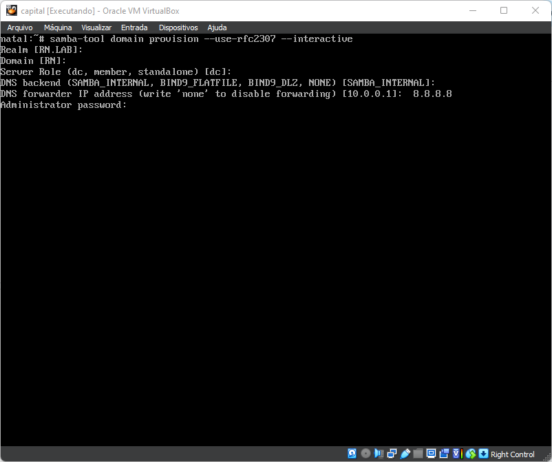

# SAMBA4: INSTALAÇÃO NO ALPINE LINUX

Essa documentação foi baseada no seguinte [Roteiro](https://wiki.alpinelinux.org/wiki/Setting_up_a_samba-ad-dc)

##**Instalação dos pacotes Necessarios:**

    $ apk add samba-dc krb5 

Instalei tambem um editor de texto e outros pacotes de minha preferencia

    $ apk add nano vi vim bat ccze

##**Definindo o Hostname da Maquina:**

Acessando os arquivos de configuração é possivel alterar o nome da maquina 

    $ nano /etc/hostname

Altere-o para o nome de sua preferencia 

    capital.estado.lab

Alterei para:

    natal.rn.lab

E no arquivo /etc/hosts onde havia o nome 

    capital capital.estado.lab 

Alterei para:

    natal natal.rn.lab

Salve os arquivos e pronto!

##**Editando o arquivo de configuração do Samba4**

Podemos acessar o arquivo de configuração do samba em /etc/samba/smb.conf

    $ nano /etc/samba/smb.conf

devemos deixa-lo assim:

    [global]
        server role = domain controller
        workgroup = EXAMPLE
        realm = example.com
        netbios name = HOSTNAME
        passdb backend = samba4
        idmap_ldb:use rfc2307 = yes

    [netlogon]
        path = /var/lib/samba/sysvol/example.com/scripts
        read only = No

    [sysvol]
        path = /var/lib/samba/sysvol
        read only = No

Para isso voce pode acessar via SSH o que iria facilitar a edição do arquivo ou voce pode apagar o arquivo e cria-lo novamente vazio.

Comandos para apagar e criar o arquivo:

    $ rm /etc/samba/smb.conf #apaga o arquivo

    $ nano /etc/samba/smb.conf #cria e ja abre com o editor nano

meu arquivo ficou assim:

    [global]
        server role = domain controller
        workgroup = RN
        realm = RN.LAB
        netbios name = NATAL
        passdb backend = samba4
        idmap_ldb:use rfc2307 = yes

    [netlogon]
        path = /var/lib/samba/sysvol/rn.lab/scripts
        read only = No

    [sysvol]
        path = /var/lib/samba/sysvol
        read only = No

Pronto!

##**Iniciando a configuraçao do domino do Samba:**

comando:

    $ samba-tool domain provision --use-rfc2307 --interactive

Pode seguir as opções padrões. na opção do forwarder IP você pode colocar o seu Servidor DNS ou outro de sua escolha, no meu caso utilizei o do Google (8.8.8.8).

##**Configurando o arquivo /etc/resolv.conf**

Aqui um exemplo de como o arquivo deve ficar:

    search example.com
    nameserver 10.1.1.10

No meu caso ficou assim:

    search rn.lab
    nameserver 192.168.56.65

##**Configurando o Kerberos**

Precisamos criar um link do arquivo krb5.conf no diretório /etc/, que apontará para o arquivo krb5.conf localizado em /var/lib/samba/private/.

comando:

    $ ln -sf /var/lib/samba/private/krb5.conf /etc/krb5.conf

##**Configurando o serviço Samba para iniciar**

comando para iniciar o serviço do Samba ao ligar a maquina:

    $ rc-update add samba

comando para iniciar agora:

    $ rc-service samba start

Pronto o Samba está instalado e configurado.